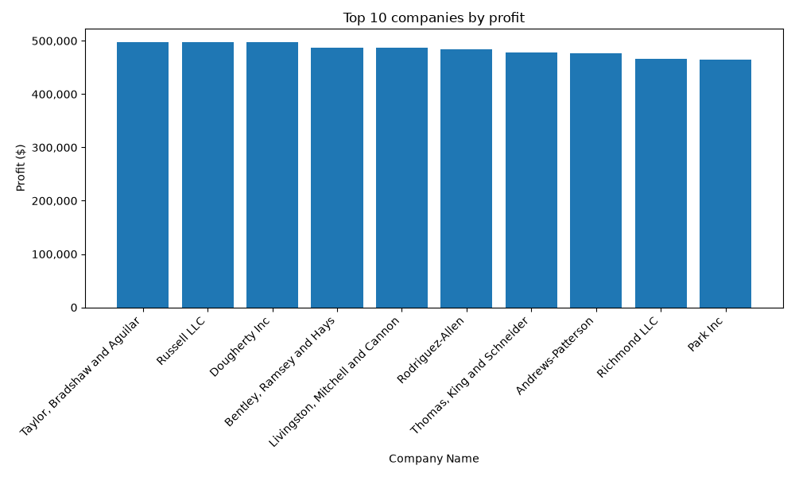
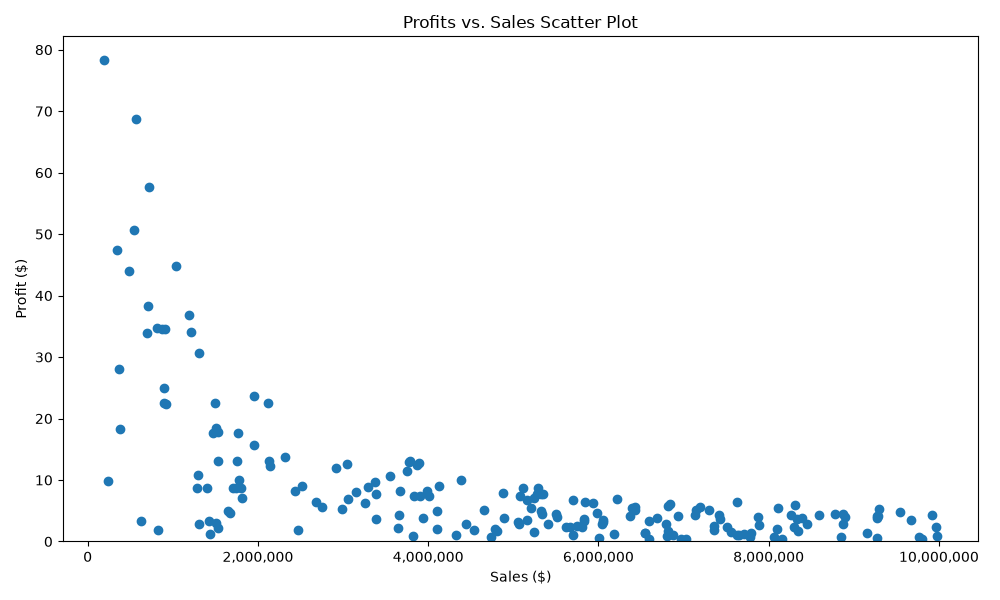

# Company Financial Data Analysis

A data analysis project using a synthetic dataset of 200 companies, exploring key financial metrics including sales, profits, assets, and profit margins.

This project was built to practice data exploration, cleaning, visualization, and version control using Python and GitHub.

---

## Tools Used

- **Python 3.14**
- **pandas** — data loading, cleaning, and analysis
- **matplotlib** — data visualization
- **LibreOffice Calc** — initial exploration and pivot tables
- **Git & GitHub** — version control

---

## What the Script Does

1. Loads and inspects the dataset (shape, data types, preview)
2. Creates a derived `profit_margin` column (profits / sales × 100)
3. Generates summary statistics (min, max, mean, median, count)
4. Detects and flags data quality outliers (companies where profits exceed sales)
5. Filters outliers out for clean analysis
6. Produces two charts saved as PNG files

---

## How to Run

1. Clone the repository:
   ```
   git clone https://github.com/OubaiRif/company-financial-analysis.git
   ```

2. Navigate into the project folder:
   ```
   cd company-financial-analysis
   ```

3. Install dependencies:
   ```
   pip3 install pandas matplotlib
   ```

4. Run the script:
   ```
   python3 analysis.py
   ```

---

## Key Findings

- **3 outliers** were identified where profits exceeded total sales — a data quality issue common in synthetic datasets
- **Taylor, Bradshaw and Aguilar** had the highest absolute profits among clean companies
- **No strong correlation** was found between sales volume and profit margin
- Companies with lower sales tended to have more variable and sometimes higher margins, while high-sales companies clustered around thin, consistent margins — consistent with a volume vs efficiency tradeoff

---

## Charts

### Top 10 Companies by Profit


### Sales vs Profit Margin


---

## Dataset

Synthetic company financial data sourced from [Kaggle](https://www.kaggle.com). 
Contains 200 fictional companies with sales, profits, assets, rank, and profit margin columns.
Not representative of real-world financial data.
